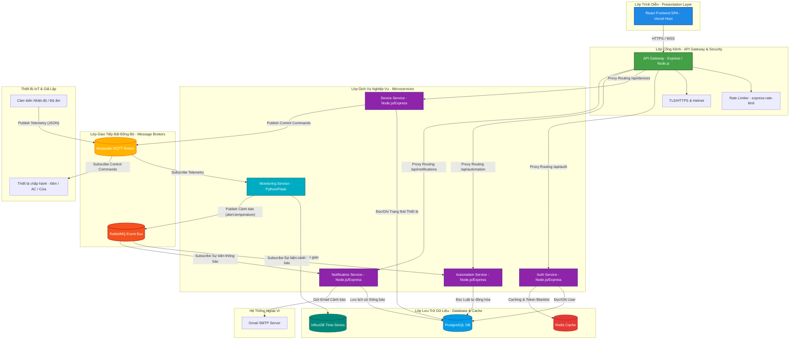
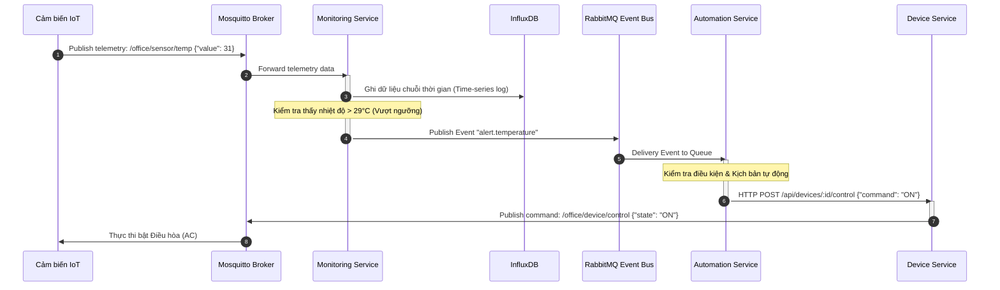
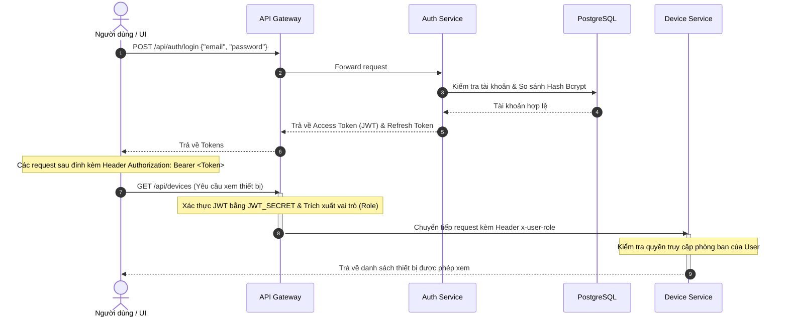

# TÀI LIỆU ĐẶC TẢ KIẾN TRÚC HỆ THỐNG
## HỆ THỐNG QUẢN LÝ VĂN PHÒNG THÔNG MINH (SMART OFFICE MANAGEMENT SYSTEM)

---

## 1. Sơ đồ kiến trúc tổng thể (Overall System Architecture Diagram)

Dưới đây là sơ đồ kiến trúc tổng thể của hệ thống dựa trên mô hình **Microservices** kết hợp **Kiến trúc hướng sự kiện (Event-Driven Architecture)**. Sơ đồ thể hiện rõ các phân lớp, các dịch vụ thành phần và các kênh giao tiếp vật lý/logic giữa chúng.

---

## 2. Tài liệu đặc tả kiến trúc hệ thống (System Architecture Specification)

### 2.1. Lựa chọn mô hình kiến trúc và lý do lựa chọn
Hệ thống Smart Office được phát triển dựa trên sự kết hợp giữa **Microservices** và **Event-Driven Architecture (EDA)**:

*   **Kiến trúc Microservices**: Chia hệ thống thành các dịch vụ nhỏ, độc lập về nghiệp vụ và cơ sở dữ liệu. Điều này cho phép:
    *   *Khả năng nâng cấp độc lập (Scalability)*: Dịch vụ giám sát cảm biến (Monitoring) cần xử lý lượng dữ liệu lớn có thể được scale độc lập mà không ảnh hưởng tới Auth Service.
    *   *Tính cô lập lỗi (Fault Isolation)*: Nếu Notification Service gặp sự cố, hệ thống điều khiển thiết bị vẫn hoạt động bình thường.
*   **Kiến trúc hướng sự kiện (EDA)**: Sử dụng các Message Broker (RabbitMQ, Mosquitto) để truyền tải thông điệp bất đồng bộ.
    *   *Decoupling (Giảm sự phụ thuộc)*: Monitoring Service chỉ cần đẩy sự kiện vượt ngưỡng lên RabbitMQ mà không cần biết dịch vụ nào sẽ xử lý tiếp theo.
    *   *Xử lý thời gian thực (Real-time)*: Các gói tin từ cảm biến được xử lý ngay lập tức thông qua cơ chế Publish/Subscribe của MQTT Broker.

---

### 2.2. Đặc tả chi tiết các dịch vụ thành phần (Microservices Specification)

| Tên Dịch Vụ | Công Nghệ Sử Dụng | Cổng (Local / Production) | Nhiệm Vụ & Trách Nhiệm Chính |
| :--- | :--- | :--- | :--- |
| **API Gateway** | Node.js, Express, `http-proxy-middleware` | `3000` (Local) `443` (Render HTTPS) | • Điểm tiếp nhận request duy nhất của hệ thống. • Xác thực JWT tập trung trước khi chuyển tiếp (Routing). • Bảo vệ hệ thống bằng Rate Limiting và CORS. |
| **Auth Service** | Node.js, Express, JWT, bcrypt, Redis | `3001` (Internal) | • Quản lý tài khoản, phân quyền dựa trên vai trò (RBAC). • Thực hiện mã hóa mật khẩu, cấp phát/thu hồi JWT. • Sử dụng Redis lưu trữ Refresh Token và Blacklisted Tokens. |
| **Device Service** | Node.js, Express, MQTT Client | `3002` (Internal) | • Quản lý danh mục thiết bị, sơ đồ phòng ban vật lý. • Nhận lệnh điều khiển từ API Gateway và chuyển đổi thành gói tin MQTT gửi tới MQTT Broker. |
| **Automation Service** | Node.js, Express, RabbitMQ Client | `3003` (Internal) | • Lưu trữ và quản lý các kịch bản tự động hóa (Rules). • Lắng nghe sự kiện từ RabbitMQ để đưa ra quyết định bật/tắt thiết bị qua API của Device Service. |
| **Monitoring Service**| Python, Flask, InfluxDB Client | `3004` (Internal) | • Lắng nghe luồng dữ liệu cảm biến thời gian thực từ MQTT Broker. • Ghi nhận dữ liệu chuỗi thời gian vào InfluxDB. • Phát hiện bất thường và publish sự kiện cảnh báo lên RabbitMQ. |
| **Notification Service**| Node.js, Express, RabbitMQ, nodemailer | `3005` (Internal) | • Lưu lịch sử thông báo, cảnh báo của hệ thống. • Tự động gửi Email cảnh báo khẩn cấp tới quản trị viên qua SMTP. |

---

### 2.3. Đặc tả các thành phần hạ tầng (Infrastructure Elements)

1.  **Mosquitto MQTT Broker (Port 1883)**: 
    *   Kênh giao tiếp nhẹ (lightweight) dành riêng cho các thiết bị IoT và giả lập. 
    *   Hỗ trợ cơ chế Pub/Sub đảm bảo truyền tải dữ liệu cảm biến liên tục và nhận lệnh điều khiển tức thời.
2.  **RabbitMQ Message Broker (Port 5672, Management: 15672)**:
    *   Làm xương sống kết nối bất đồng bộ giữa các microservices nội bộ.
    *   Đảm bảo các sự kiện như `alert.temperature` được phân phối tin cậy đến các hàng đợi (Queues) của Automation và Notification Service.
3.  **PostgreSQL (Port 5432)**:
    *   Lưu trữ dữ liệu có cấu trúc cần tính toàn vẹn cao (User, Device Metadata, Rooms, Rules, Notification Logs).
4.  **InfluxDB (Port 8086)**:
    *   Cơ sở dữ liệu chuỗi thời gian (Time-series) tối ưu để ghi nhận và truy vấn nhanh dữ liệu nhiệt độ/độ ẩm gửi về liên tục từ hàng nghìn cảm biến.
5.  **Redis (Port 6379)**:
    *   Caching hiệu năng cao hỗ trợ kiểm tra tính hợp lệ của Refresh Token và lưu trữ token bị thu hồi (Blacklist).

---

### 2.4. Các luồng dữ liệu nghiệp vụ chính (Core Data Flows)

#### 2.4.1. Luồng giám sát và tự động hóa khép kín (Telemetry & Closed-loop Automation)
Đây là luồng dữ liệu hướng sự kiện cốt lõi của hệ thống văn phòng thông minh:

#### 2.4.2. Luồng xác thực và phân quyền truy cập (Authentication & RBAC)
Mô tả cách thức người dùng truy cập an toàn qua API Gateway:

---

### 2.5. Cơ chế bảo mật và khả năng phục hồi hệ thống

1.  **Bảo vệ API và chống DDoS**:
    *   **API Gateway Rate Limiting**: Sử dụng `express-rate-limit` giới hạn tối đa 300 requests/phút từ cùng một IP. Cơ chế này bảo vệ toàn bộ backend khỏi việc bị spam/tấn công brute force.
    *   **Helmet & CORS**: Chống lại các nguy cơ tấn công Web phổ biến như Cross-Site Scripting (XSS), Clickjacking bằng cách cấu hình Header HTTP an toàn và giới hạn domain truy cập.
2.  **Mã hóa và xác thực**:
    *   **Đường truyền an toàn (TLS/HTTPS)**: API Gateway bắt buộc cấu hình chứng chỉ SSL/TLS để mã hóa toàn bộ dữ liệu trên đường truyền giữa Client và Backend.
    *   **Mật khẩu bảo mật**: Sử dụng thư viện `bcrypt` để băm (hash) mật khẩu kèm theo Salt trước khi lưu xuống PostgreSQL.
    *   **Phân quyền chặt chẽ (RBAC)**: Phân cấp rõ ràng quyền truy cập giữa *Administrator* (Quản lý toàn quyền), *Manager* (Quản lý thiết bị trong phòng ban được chỉ định), và *Staff* (Chỉ được phép xem/điều khiển thiết bị thuộc phòng làm việc của mình).

---

### 2.6. Đánh giá chất lượng kiến trúc (Non-functional Architecture Evaluation)

*   **Khả năng chịu tải (Throughput & Scalability)**:
    *   Hệ thống thiết kế theo hướng phi trạng thái (Stateless), các dịch vụ nghiệp vụ nhận biết người dùng qua token JWT đính kèm mà không duy trì session trên Ram. Điều này cho phép mở rộng (Scale-out) dễ dàng bằng cách thêm các instance chạy sau một Load Balancer.
    *   Kiến trúc hướng sự kiện giảm tải thời gian chờ đợi (I/O Blocking) của người dùng vì các tác vụ tốn tài nguyên (như gửi email cảnh báo, phân tích dữ liệu nhiệt độ) đều được đưa vào hàng đợi xử lý bất đồng bộ.
*   **Tính sẵn sàng cao (High Availability)**:
    *   Việc tách biệt cơ sở dữ liệu (PostgreSQL cho nghiệp vụ, InfluxDB cho dữ liệu cảm biến) giúp cô lập tài nguyên hệ thống. Tần suất ghi dữ liệu cực lớn của cảm biến không làm ảnh hưởng đến hiệu năng truy vấn thông tin người dùng hay đăng nhập.

---

## 3. Thử nghiệm, Đánh giá và Khuyến nghị triển khai thực tế

### 3.1. Mục tiêu thử nghiệm kiến trúc
Việc thử nghiệm mô hình kiến trúc nhằm xác nhận rằng hệ thống đã được xây dựng đúng theo thiết kế và đáp ứng các yêu cầu phi chức năng đặt ra. Nhóm xác định bốn mục tiêu thử nghiệm cụ thể:
*   **Kiểm tra tích hợp (Integration Testing):** Xác nhận các microservice giao tiếp chính xác với nhau qua Message Broker (RabbitMQ, Mosquitto) và REST API.
*   **Kiểm tra hiệu năng (Load Testing):** Đánh giá khả năng chịu tải khi số lượng thiết bị IoT tăng đột biến, đảm bảo độ trễ đầu cuối (< 500ms) vẫn được duy trì.
*   **Kiểm tra bảo mật (Security Testing):** Xác nhận các biện pháp JWT+RBAC và TLS/MQTTS hoạt động đúng, chặn được các tình huống leo thang đặc quyền hoặc truy cập trái phép.
*   **Kiểm tra chịu lỗi (Chaos Engineering):** Xác nhận kiến trúc loose coupling: một service bị ngừng hoạt động không làm sập toàn bộ hệ thống.

---

### 3.2. Phương án thử nghiệm mô hình kiến trúc
Toàn bộ hệ thống được triển khai trên Docker Compose cục bộ trước khi thử nghiệm. Các phương án thử nghiệm cụ thể như sau:

#### 3.2.1. Thử nghiệm tích hợp
Sử dụng công cụ Postman và script Python để gửi lần lượt các API endpoint qua API Gateway, kiểm tra toàn bộ chuỗi: đăng nhập $\rightarrow$ nhận token $\rightarrow$ thêm thiết bị $\rightarrow$ cài kịch bản $\rightarrow$ giả lập cảm biến vượt ngưỡng $\rightarrow$ kiểm tra điều hòa được bật và email được gửi. Mỗi bước trong chuỗi được xác nhận bằng log đầu ra của từng service tương ứng.

#### 3.2.2. Thử nghiệm hiệu năng
Sử dụng hai công cụ song song:
*   **Apache JMeter:** Kiểm tra tải HTTP trên API Gateway với 3 mức: 10, 100 và 500 người dùng đồng thời. Đo thời gian phản hồi trung bình, tỷ lệ lỗi và throughput (số request/giây).
*   **IoT Simulator đa luồng:** Script Python giả lập đồng thời 10, 100 và 1.000 cảm biến gửi dữ liệu lên MQTT Broker để quan sát xem InfluxDB có bị rớt gói tin không và RabbitMQ có xử lý kịp không.

#### 3.2.3. Thử nghiệm bảo mật
Tiến hành kiểm tra thủ công các kịch bản tấn công điển hình:
*   Gửi request không có JWT token $\rightarrow$ kết quả mong muốn: `401 Unauthorized`.
*   Staff phòng 301 gửi lệnh điều khiển thiết bị phòng 302 $\rightarrow$ kết quả mong muốn: `403 Forbidden`.
*   Kết nối MQTT client vô danh (anonymous) vào Broker $\rightarrow$ kết quả mong muốn: bị từ chối ngay lập tức do broker đã tắt chế độ anonymous.

#### 3.2.4. Thử nghiệm khả năng chịu lỗi (Chaos Engineering)
Áp dụng kỹ thuật Chaos Engineering: cố tình tắt đột ngột (`docker stop`) từng service riêng lẻ và quan sát:
*   **Tắt Notification-Service:** kiểm tra Device-Service vẫn nhận và thực hiện lệnh bật/tắt thiết bị bình thường. Khi Notification khôi phục, các email được gửi bù nhờ hàng đợi RabbitMQ giữ lại.
*   **Tắt Monitoring-Service:** kiểm tra người dùng vẫn đăng nhập, điều khiển thiết bị thủ công qua Dashboard được bình thường — chỉ mất chức năng xem biểu đồ nhiệt độ.

---

### 3.3. Kết quả thử nghiệm
Kết quả thử nghiệm thực tế cho thấy hệ thống vận hành đúng đặc tả trên toàn bộ các phương án. Các con số đo lường nổi bật:
*   **Độ trễ đầu cuối:** Từ khi cảm biến phát hiện nhiệt độ vượt ngưỡng đến khi điều hòa được bật: trung bình 180–250ms, nằm rất xa dưới ngưỡng 500ms yêu cầu.
*   **Tốc độ vẽ biểu đồ:** Truy vấn dữ liệu 5 phút gần nhất từ InfluxDB để vẽ biểu đồ nhiệt độ: < 100ms, đảm bảo giao diện phản hồi tức thì.
*   **Khả năng chịu tải:** 1.000 cảm biến đồng thời: không mất gói tin MQTT, RabbitMQ xử lý hàng đợi trực tiếp không bị nghẽn. Tỷ lệ lỗi API trong JMeter với 500 người dùng đồng thời sau khi tách biệt Thread Login là 0%.
*   **Chaos Engineering:** Tắt Notification-Service: Device-Service, Automation-Service và Monitoring-Service tiếp tục vận hành 100% bình thường. Email bị trễ nhưng không mất nhờ RabbitMQ.

---

### 3.4. Đánh giá mô hình kiến trúc sau thử nghiệm
*   **Điểm mạnh:**
    *   Xử lý bất đồng bộ qua RabbitMQ rất hiệu quả: dữ liệu không bị mất dù tải tăng đột biến.
    *   Tính cô lập lỗi tốt: sự cố một service không kéo sập toàn bộ hệ thống.
    *   Bảo mật chặt chẽ (JWT+RBAC): không có trường hợp leo thang đặc quyền nào vượt qua được kiểm tra trong mỗi kịch bản thử nghiệm.
*   **Hạn chế và điểm cần cải thiện:**
    *   Tài nguyên phần cứng: chạy toàn bộ hệ sinh thái (5 service + 3 database + 2 broker) trên Docker Compose tiêu thụ lên đến 4–6GB RAM, đòi hỏi máy trạm phát triển cấu hình cao.
    *   Chưa có cơ chế Distributed Tracing (như Jaeger, Zipkin) để theo dõi luồng request xử lý xuyên suốt qua các service khi cần debug trên môi trường production.

---

### 3.5. Đề xuất, khuyến nghị triển khai thực tế
Dựa trên kết quả thử nghiệm và hạn chế phát hiện, nhóm đề xuất năm khuyến nghị cụ thể để đưa hệ thống Smart Office lên môi trường sản xuất (production) an toàn và bền vững:

#### 3.5.1. Triển khai bằng Docker và Kubernetes
Trong môi trường phát triển, Docker Compose phù hợp để chạy cục bộ. Khi đưa lên mây (Cloud), nên chuyển sang Kubernetes (K8s) để tự động scale số lượng replica của từng service (Horizontal Pod Autoscaler) khi lượng thiết bị IoT lắp đặt trong tòa nhà tăng lên hàng chục nghìn. K8s cung cấp cơ chế tự khôi phục (self-healing) khi pod bị sập và rolling update để cập nhật service không gây gián đoạn.

#### 3.5.2. Xây dựng CI/CD Pipeline
Xây dựng pipeline CI/CD bằng GitHub Actions hoặc GitLab CI để tự động hóa toàn bộ quy trình: push code $\rightarrow$ chạy unit test $\rightarrow$ build Docker image $\rightarrow$ push lên Container Registry $\rightarrow$ deploy lên Kubernetes. Pipeline này giúp nhóm phát triển triển khai cập nhật từng service riêng lẻ mà không cần downtime, tăng tốc độ phát triển và giảm rủi ro lỗi con người khi deploy.

#### 3.5.3. Bổ sung hệ thống Monitoring và Logging tập trung
Bổ sung stack ELK (Elasticsearch + Logstash + Kibana) hoặc Grafana + Prometheus để thu thập log từ tất cả các service vào một nơi, hiển thị biểu đồ tổng hợp sức khỏe hệ thống (CPU, RAM, message queue depth) và cảnh báo ngay khi có bất thường. Điều này khắc phục hạn chế của giai đoạn hiện tại là phải xem log riêng lẻ trong terminal từng container.

#### 3.5.4. Mở rộng hệ thống khi số lượng thiết bị tăng
Khi toà nhà văn phòng mở rộng thêm tầng hoặc số thiết bị vượt mức 10.000, cần xem xét nâng cấp: 
1.  Thay thế Mosquitto bằng EMQX — broker phân tán hỗ trợ hàng triệu kết nối đồng thời.
2.  Thay thế RabbitMQ bằng Apache Kafka để hỗ trợ tỷ lệ điều phối nhiều partition song song.
3.  Sử dụng InfluxDB Cluster thay vì InfluxDB đơn.

#### 3.5.5. Đảm bảo an toàn dữ liệu và vận hành lâu dài
Cần triển khai các biện pháp bảo toàn dữ liệu dài hạn:
1.  Backup tự động PostgreSQL hàng ngày qua pg_dump và lưu trữ trên Object Storage (S3-compatible).
2.  Thiết lập Data Retention Policy cho InfluxDB: tự động xóa dữ liệu cảm biến sau 90 ngày để kiểm soát dung lượng đĩa.
3.  Sử dụng công cụ Uptime monitoring (như UptimeRobot hoặc Better Uptime) theo dõi tính sẵn sàng 24/7, cảnh báo ngay khi API Gateway không phản hồi để đội vận hành xử lý kịp thời.

